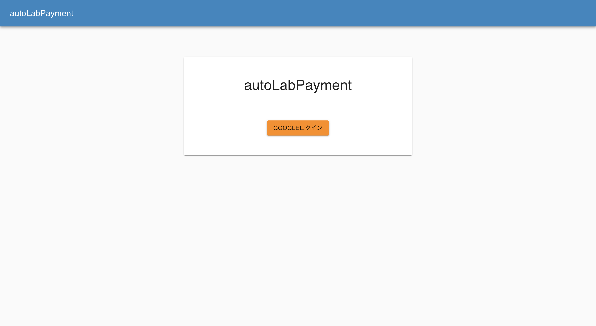
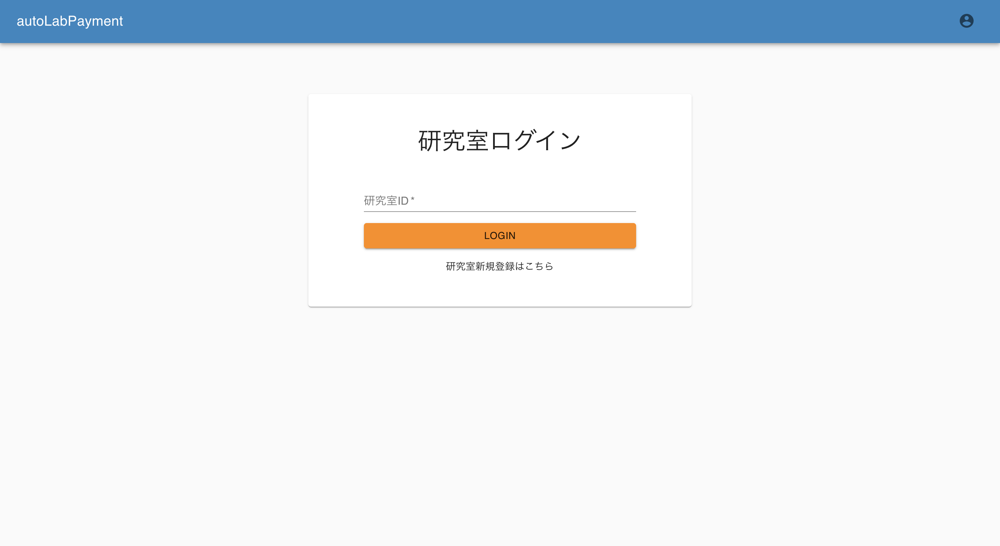
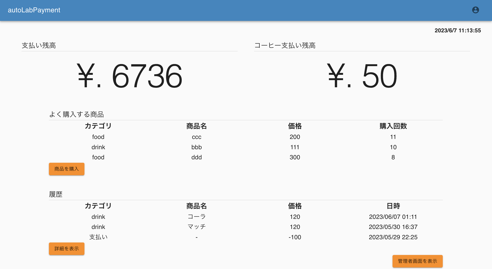
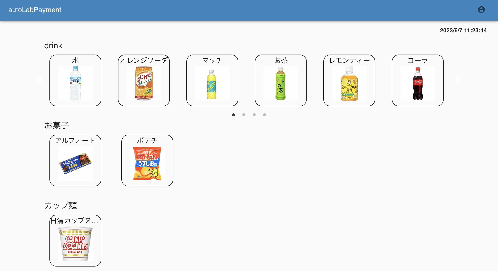
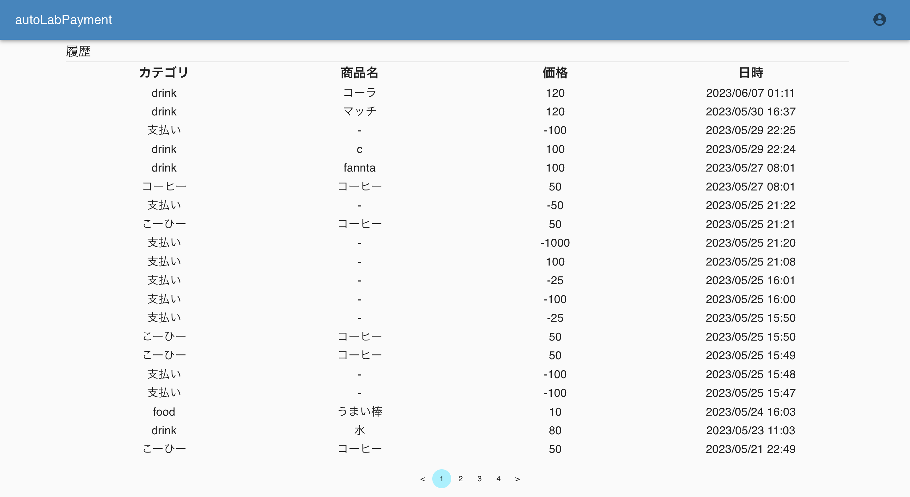
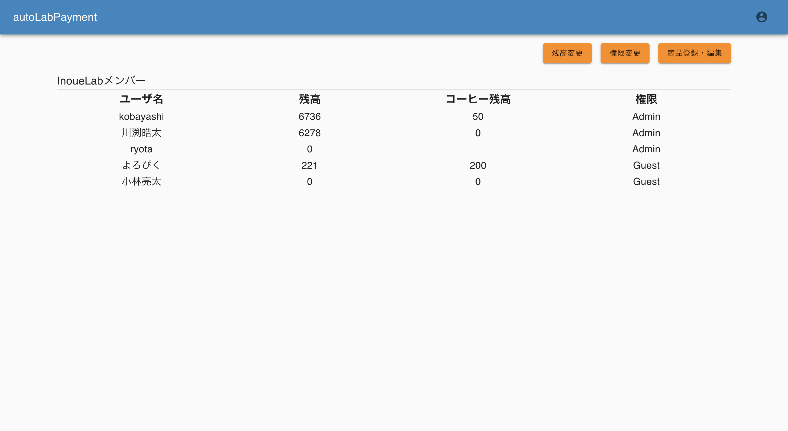
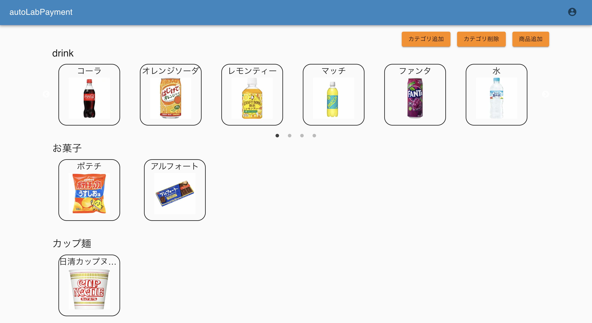

# autoLabPayment

autoLabPaymentは，研究室の商品購入履歴や残高を管理するためのアプリです．管理者は，商品の追加や削除，その他ユーザーの残高変更などを行うことができます．ユーザーは，商品の購入，残高・購入履歴の確認などができます．

[autoLabPaymentを使用する](https://autolabpayment.vercel.app/login)

## ログイン

Googleアカウントを使用してログインを行なってください．
その後，研究室IDを入力して，自身のコミュニティにログインをしてください．
新しいコミュニティを作成する場合は，研究室新規登録から作成することができます．

## マイページ

マイページでは，自身の残高や購入履歴，よく購入する商品を閲覧することができます．

## 商品購入画面

商品購入画面では，登録された商品を購入することができます．

## 履歴確認

履歴の確認もできます．

## 管理者画面

管理者画面では，残高の編集，商品の登録・削除などを行えます．

